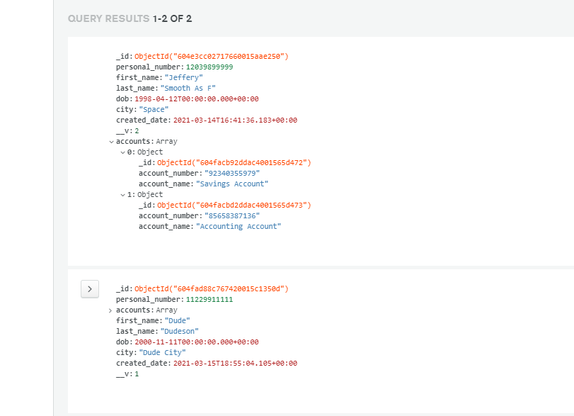

# Assignment 1 Cloud Tech README

## Heroku link

[ABC Heroku app link CLICK ME](https://abcbankvilde.herokuapp.com/)

or copy paste this link: https://abcbankvilde.herokuapp.com/

## Marks

* **Client server design and validation –5 points**
    * Should be working as intended.

* **Database design –2 points**
    * Link to schema: [CLICK ME](./models/customer.js)
    * DB on MongoDB website:
    

* **Database connection –2 points**
    * Mongoose / MongoDB should be 100% functional.

* **Client-server connection –2 points**
    * From our understandning, we believe we have done this.

* **At least 1 REST API(https://restfulapi.net/) should use(get, post, put, delete)-7 points**
    * Link to the file this is mainly in: [CLICK ME](./routes/customers.js).

* **At least 1 DB query should work –5 points**
    * Insert, delete, update etc. should be working as intended.
* **Deployed to Heroku server –2 points**
    * Done.
    * Again, [CLICK ME](https://abcbankvilde.herokuapp.com/) to go to the heroku app
* **Additional task –5 points**
    * A simple latency calculation is console logged. 
## Notes

* This is our understanding of the assignment.

